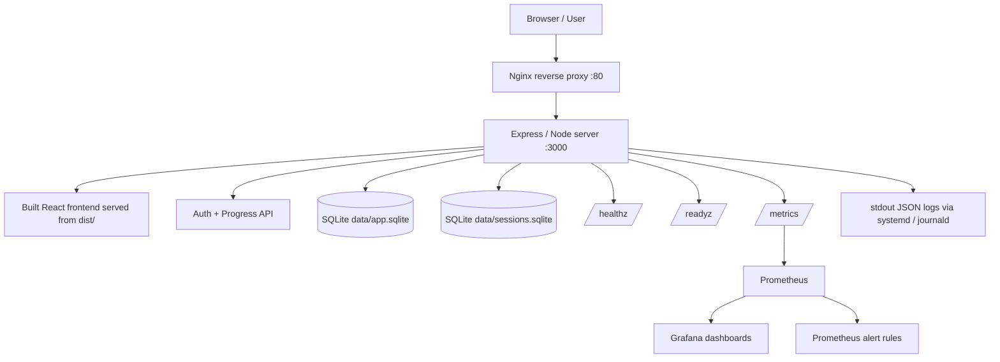

# LFCS Study Dashboard — Architecture

This document describes the current baseline architecture before Docker, AWS, Kubernetes, Terraform, or expanded observability are added.

## Current Architecture

## Runtime Components

| Component | Purpose |
|---|---|
| React / Vite | Frontend study dashboard UI |
| Express / Node | Backend API, auth, health checks, readiness checks, metrics, and static frontend serving |
| SQLite | Local persistence for users, sessions, and progress |
| systemd | Runs the Node application as a Linux service |
| Nginx | Reverse proxy in front of Express |
| Prometheus | Scrapes application metrics from `/metrics` |
| Grafana | Visualizes operational metrics |
| journald | Stores structured JSON logs emitted by the app through stdout |

## Request Flow

1. A user opens the app in a browser.
2. Nginx receives HTTP traffic on port 80.
3. Nginx proxies the request to Express on port 3000.
4. Express serves the built React frontend or handles API requests.
5. Authenticated API requests read from or write to SQLite.
6. Express emits structured JSON logs to stdout.
7. systemd captures stdout logs into journald.
8. Prometheus scrapes `/metrics`.
9. Grafana visualizes Prometheus metrics.

## Operational Endpoints

| Endpoint | Purpose |
|---|---|
| `/healthz` | Confirms the application process is healthy |
| `/readyz` | Confirms the application is ready and SQLite is reachable |
| `/metrics` | Exposes Prometheus metrics |
| `/health` | Legacy/simple health endpoint |

## Current Scope

This is currently a single-host Linux deployment.

In scope:

- local development
- production-style Node run
- Ubuntu VM deployment
- systemd service management
- Nginx reverse proxy
- structured logs
- Prometheus metrics
- Grafana dashboarding
- SLO and alert documentation

Out of scope for this baseline phase:

- Docker
- AWS
- Terraform
- Kubernetes
- multi-node deployment
- managed databases
EOF
